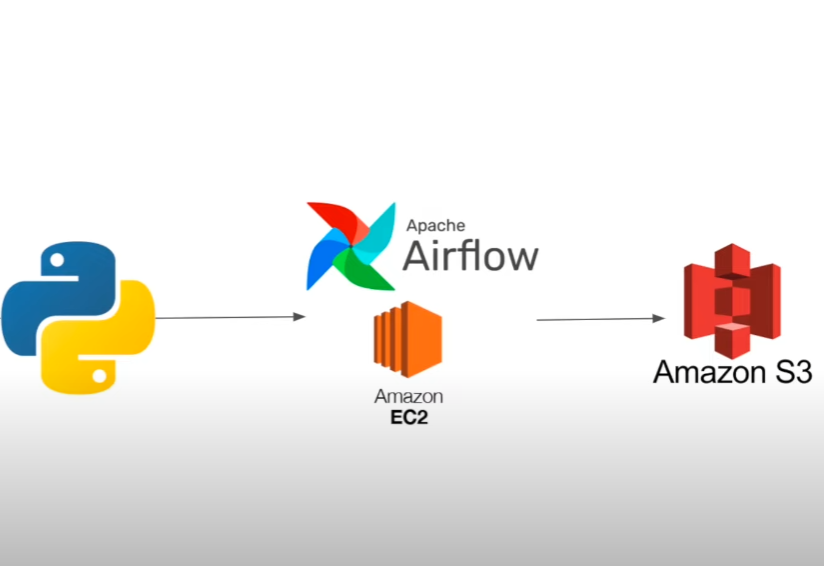

# YouTube Data Pipeline using Airflow and Python

## Overview

This is an end-to-end data engineering project that demonstrates how to build a data pipeline to extract, transform, and load (ETL) YouTube comment data using Apache Airflow and Python. In this project, we will:

1. **Extract** YouTube comment data using the YouTube Data API v3.
2. **Transform** the data using Python and Pandas to structure it for further analysis.
3. **Load** the processed data into Amazon S3 for storage and further analysis.
4. **Automate** the pipeline with Apache Airflow running on an EC2 instance.

## Key Components

- **YouTube Data API v3**: Used to extract comment data from YouTube videos.
    - รักใครไม่ไหว - Three Man Down |Official MV| (https://www.youtube.com/watch?v=F_v_Qj6watw)
- **Google API Client** (`googleapiclient`): Python package to interact with the YouTube API.
- **Pandas**: Python package used to manipulate and transform the comment data.
- **Airflow**: Used for workflow orchestration and automating the pipeline.
- **Amazon S3**: Used to store the final transformed data.
